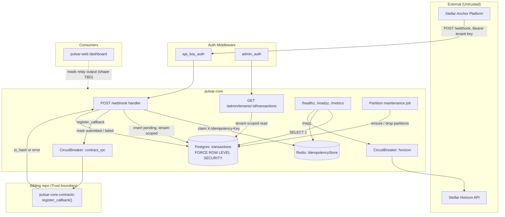

# Pulsar-Core 🛰️

[](https://stellar.org)
[](https://soroban.stellar.org)
[](Cargo.toml)
[](Cargo.toml)

Rust off-chain relay for **Pulsar Bridge** — ingests Stellar Anchor Platform deposit webhooks, deduplicates and persists them with tenant-isolated Postgres storage, and mirrors confirmed deposits on-chain via a Soroban contract call.

## Table of Contents

- [Repository Layout](#repository-layout)
- [Overview](#overview)
- [Features](#features)
- [Architecture](#architecture)
- [Idempotency \& the Webhook Lifecycle](#idempotency--the-webhook-lifecycle)
- [Tenant Isolation \& Row-Level Security](#tenant-isolation--row-level-security)
- [Circuit Breaker \& Resilience](#circuit-breaker--resilience)
- [Partition Maintenance](#partition-maintenance)
- [Contract Integration Status](#contract-integration-status)
- [Repository Structure](#repository-structure)
- [Quick Start](#quick-start)
- [Troubleshooting](#troubleshooting)
- [API Reference](#api-reference)
- [Observability](#observability)
- [Testing](#testing)
- [Roadmap](#roadmap)
- [Why This Matters](#why-this-matters)
- [Dependencies](#dependencies)
- [License](#license)
- [Contributing](#contributing)
- [Pulsar Bridge Organization](#pulsar-bridge-organization)
- [Getting Help](#getting-help)
- [Support](#support)
- [References](#references)

## Repository Layout

A quick map of the top-level directories so you can navigate the codebase before diving into any one part:

| Directory / File | Language / Toolchain | Role |
|---|---|---|
| `src/handlers/` | Rust (axum) | HTTP handlers: `/webhook`, `/admin/tenants/:id/transactions`, `/healthz`, `/readyz`, `/metrics` |
| `src/middleware/` | Rust (axum) | `api_key_auth` / `admin_auth` — bearer-token auth with rate limiting and constant-time comparison |
| `src/db/` | Rust (sqlx) | Postgres pool, `begin_tenant_scoped` (RLS scoping), partition-maintenance background job |
| `src/contracts/` | Rust (reqwest) | `ContractClient` trait + `SorobanContractClient`, calls `pulsar-core-contracts`' `register_callback()` |
| `src/horizon.rs` | Rust (reqwest) | Circuit-breaker-guarded Stellar Horizon client, used by `/readyz` |
| `src/circuit_breaker.rs` | Rust | Minimal closed/open/half-open breaker shared by the Horizon and contract clients |
| `src/redis_store.rs` | Rust (redis) | `IdempotencyStore` — `SET NX EX` claim/release for `X-Idempotency-Key` |
| `src/error.rs` | Rust | Typed `AppError` → HTTP status + stable machine-readable `code` |
| `src/config.rs` | Rust | Env-driven `Config`, plus the `assert_not_rls_bypassing` startup guard |
| `src/metrics.rs` | Rust | Dependency-free Prometheus counters, exposed at `GET /metrics` |
| `migrations/` | SQL (sqlx migrate) | Time-partitioned, RLS-forced `transactions` table + partition-maintenance functions |
| `docs/` | Markdown | Security design, auth rate limiting, quota configuration, contract integration status |
| `sdks/openapi.yaml` | OpenAPI 3.0 | Tracks only the actually-implemented, actually-merged API surface |
| `scripts/db/init-roles.sh` | Bash | Provisions the least-privilege `pulsar_app` role at first container boot |
| `scripts/load/webhook.js` | JavaScript (k6) | Load-test script hitting `/webhook` at a constant arrival rate |
| `docker-compose*.yml` | YAML | Base / dev / failover / load-test topologies (extend, never replace, the base file) |
| `Dockerfile` | Docker | Multi-stage build; runs as a non-root `pulsar` user |
| `Cargo.toml` | Rust (Cargo) | Crate manifest — axum, sqlx, redis, governor, reqwest, tracing |
| `CLAUDE.md.pulsar-core` | Markdown | Standing engineering brief: sibling repos, security history, ownership |
| `CONTRIBUTING.md` | Markdown | PR checklist (`fmt`/`clippy`/`build`/`test` + security/idempotency checklist) |

> The on-chain contract and the dashboard live in separate repos — see [Pulsar Bridge Organization](#pulsar-bridge-organization) for the full picture.

---

## Overview

pulsar-core is the off-chain relay at the center of **Pulsar Bridge**. It receives `POST /webhook` deposit callbacks from the Stellar Anchor Platform when a user deposits fiat, deduplicates and persists them, and mirrors each processed deposit on-chain by calling a Soroban contract's `register_callback()` entry point as the trusted `relay_signer`.

### The problem

Bridging a fiat deposit onto Stellar/Soroban means bridging two systems that don't share a trust model: the Anchor Platform's webhook delivery (which retries, and can deliver the same event more than once) and a Soroban contract call (which costs real fees and must not be invoked twice for the same deposit). A relay sitting between them has to get three things right at once:

- **Idempotency** — the same webhook delivered twice, or concurrently, must not create two transaction rows or call the contract twice
- **Tenant isolation** — this relay serves multiple tenants; one tenant must never be able to read or affect another's deposits, even through an application bug
- **Resilience** — a slow or unavailable Horizon/Soroban RPC endpoint must degrade gracefully behind a circuit breaker instead of piling up latency or hammering a struggling dependency

### What pulsar-core does

- **Receives** — accepts `POST /webhook` from the Anchor Platform, authenticated via a per-tenant bearer API key
- **Deduplicates** — claims `X-Idempotency-Key` in Redis (`SET NX EX`, 24h TTL); a concurrent or retried duplicate gets `429` instead of being processed twice
- **Persists** — writes the deposit to a time-partitioned Postgres `transactions` table, scoped end-to-end by Row-Level Security so no code path can read across tenants
- **Relays** — calls `pulsar-core-contracts`' `register_callback()` behind a circuit breaker, and records whether the on-chain call succeeded (`submitted`) or failed (`failed`)

> **Security model**: this relay's DB-role and tenant-isolation model exists specifically to make a documented failure class structurally impossible, not just discouraged by convention. See [Tenant Isolation](#tenant-isolation--row-level-security) and `docs/security-design.md`.

## Features

- **Idempotent webhook ingestion**: Redis `SET NX EX` claim per `(tenant_id, X-Idempotency-Key)`, 24h TTL matching the Anchor Platform's retry window; concurrent duplicates get `429`, and a claim is released if the request fails before any side effect
- **Tenant-isolated storage**: every tenant-owned query runs inside `db::begin_tenant_scoped`, which sets `app.tenant_id` for that transaction; `transactions` uses `FORCE ROW LEVEL SECURITY`, so not even the owning `pulsar_app` role can read across tenants
- **Least-privilege DB role by construction**: `scripts/db/init-roles.sh` provisions `pulsar_app` as `NOSUPERUSER NOCREATEDB NOCREATEROLE NOREPLICATION NOBYPASSRLS`; `Config::assert_not_rls_bypassing` refuses to start the process at all if `DATABASE_URL` ever points at a role that can bypass RLS
- **Circuit-breaker-guarded upstream calls**: a closed/open/half-open breaker wraps both the Horizon client and the Soroban contract client, so a degraded dependency fails fast (`503`) instead of cascading into webhook latency
- **Typed error handling**: `AppError` maps every failure mode to an HTTP status and a stable, machine-readable `code` — no ad hoc `anyhow`/string errors escape to a response body
- **Rate-limited auth boundary**: `api_key_auth` / `admin_auth` throttle by presented key (or client IP) *before* validating the credential, so credential-guessing attempts are throttled, not just successful callers; every failure is logged and counted
- **Automatic partition maintenance**: a background job ensures the current + next month's `transactions` partition exists and drops partitions older than `PARTITION_RETENTION_MONTHS` (default 12), every `PARTITION_MAINTENANCE_INTERVAL_SECONDS` (default 24h)
- **Prometheus metrics + structured logs**: `GET /metrics` exposes idempotency hit/miss, circuit-breaker opens, partition-job runs/failures, and auth failures; all logs are structured JSON via `tracing`

## Architecture



### Core Components

- **`src/handlers/webhook.rs`**: payload validation, idempotency claim/release, tenant-scoped insert, `register_callback` call, status transition to `submitted`/`failed`
- **`src/handlers/admin.rs`**: `list_transactions` — still goes through `begin_tenant_scoped`; admin access is an authorization decision in application code, never an RLS bypass
- **`src/handlers/health.rs`**: `/healthz` (liveness, no dependency checks), `/readyz` (checks Postgres, Redis, Horizon via its breaker, and the contract breaker state), `/metrics`
- **`src/middleware/auth.rs`**: `api_key_auth` resolves `TenantContext` from a bearer token against `TENANT_API_KEYS`; `admin_auth` checks `ADMIN_API_KEYS` with a constant-time comparison; both rate limit every attempt before validating the credential
- **`src/db/mod.rs`**: `connect` (pool) and `begin_tenant_scoped` — the only sanctioned way to open a transaction against tenant-owned tables
- **`src/db/transactions.rs`**: `insert_pending`, `mark_submitted`, `mark_failed`, `find_by_idempotency_key`, `list_for_tenant`
- **`src/db/partitions.rs`**: `run_once` / `spawn_background_job` — partition creation and retention enforcement
- **`src/contracts/mod.rs`**: `ContractClient` trait + `SorobanContractClient`, an HTTP client calling `pulsar-core-contracts`' `register_callback()`
- **`src/horizon.rs`**: thin Horizon client used only for the `/readyz` reachability probe today
- **`src/circuit_breaker.rs`**: shared closed/open/half-open implementation used by both upstream clients
- **`src/redis_store.rs`**: `IdempotencyStore::claim`/`release`/`ping`
- **`src/error.rs`** / **`src/config.rs`** / **`src/metrics.rs`** / **`src/state.rs`**: error boundary, env config + RLS guard, metrics, and shared `AppState`

The Soroban contract and the dashboard live in the `pulsar-core-contracts` and `pulsar-web` repos respectively — see [Pulsar Bridge Organization](#pulsar-bridge-organization).

## Idempotency & the Webhook Lifecycle

Every `POST /webhook` request must carry an `X-Idempotency-Key` header. `IdempotencyStore::claim` runs a single `SET NX EX` against Redis keyed on `idempotency:{tenant_id}:{key}`:

- **First delivery** — the claim is acquired, the deposit is inserted as `status = 'pending'`, and the contract call is attempted.
- **Concurrent or retried duplicate** — the `SET NX` fails, the caller gets `429 idempotency_conflict`, and nothing is inserted twice.
- **Validation failure before any side effect** — the claim is released (`IdempotencyStore::release`) so a corrected retry within the TTL window isn't needlessly dropped.

A deposit's status transitions `pending → submitted` (contract call returned a `tx_hash`) or `pending → failed` (the call errored — logged, but the webhook response still returns `201` since the deposit itself was recorded and the caller doesn't need a paid on-chain retry endpoint yet). If the same idempotency key is replayed after processing has already finished, `find_by_idempotency_key` returns the existing row and the handler responds `200` instead of re-running the contract call.

```bash
curl -X POST http://localhost:8080/webhook \
  -H "Authorization: Bearer <tenant-api-key>" \
  -H "Content-Type: application/json" \
  -H "X-Idempotency-Key: $(uuidgen)" \
  -d '{
        "external_deposit_id": "dep-123",
        "amount": "10.5000000",
        "asset_code": "USD",
        "stellar_account": "GAAAAAAAAAAAAAAAAAAAAAAAAAAAAAAAAAAAAAAAAAAAAAAAAAAAAAAAAA"
      }'
```

## Tenant Isolation & Row-Level Security

This repo's DB-role and RLS model is documented in full in `docs/security-design.md`; it exists to make a specific failure class structurally impossible rather than merely discouraged by convention: **a superuser or `BYPASSRLS` role ignores Row-Level Security silently**, so a correctly-written RLS policy has zero effect if the connection can bypass it.

The model:

1. **One application role, never a superuser.** `scripts/db/init-roles.sh` creates `pulsar_app` with `NOSUPERUSER NOCREATEDB NOCREATEROLE NOREPLICATION NOBYPASSRLS`. Every `.env*` file in this repo points at it — the Postgres bootstrap superuser is used exactly once, automatically, by Postgres's own `docker-entrypoint-initdb.d` hook, never by application code.
2. **`FORCE ROW LEVEL SECURITY`, not just `ENABLE`.** `ENABLE ROW LEVEL SECURITY` alone still lets the owning role bypass policies; `migrations/0001_create_transactions.sql` uses `FORCE`, closing that gap.
3. **Tenant scope is set per-transaction, not trusted from the query.** `db::begin_tenant_scoped` runs `SELECT set_config('app.tenant_id', $1, true)` before anything else in the transaction; the `tenant_isolation` policy on `transactions` filters every statement against it. There is no code path that queries `transactions` without first setting that scope.
4. **`assert_not_rls_bypassing` fails the process at startup**, not the request at runtime, if `DATABASE_URL` ever resolves to a role with `rolsuper` or `rolbypassrls` set (`src/config.rs`).
5. **Admin access is an authorization decision, not an RLS bypass.** `handlers::admin::list_transactions` still opens a `begin_tenant_scoped` transaction for the explicitly-named `:tenant_id` — it never runs as a role that can see every tenant's rows unconditionally.
6. **No dead code paths.** If a route isn't wired into `src/main.rs::build_router`, it doesn't exist in this repo.

## Circuit Breaker & Resilience

`src/circuit_breaker.rs` implements a minimal closed → open → half-open breaker, instantiated independently for the Horizon client and the Soroban contract client (both currently configured from the same `HORIZON_CIRCUIT_BREAKER_FAILURE_THRESHOLD` / `HORIZON_CIRCUIT_BREAKER_RESET_AFTER_SECONDS` env vars — see `src/main.rs`).

- **Closed** — calls pass through; consecutive failures increment a counter.
- **Open** — once `failure_threshold` consecutive failures are hit, the breaker opens; every call is rejected immediately with `AppError::CircuitOpen` (`503`) without making the network call, and `pulsar_circuit_breaker_opens_total` is incremented.
- **Half-open** — after `reset_after` elapses, the next call is allowed through as a probe; success closes the breaker, failure re-opens it.

`/readyz` checks breaker state directly (`horizon.breaker_state()`, `contracts.breaker_state()`) so an open breaker fails readiness instead of accepting traffic the process already knows it can't fulfill.

## Partition Maintenance

`src/db/partitions.rs` runs once at startup (`db::partitions::run_once`, called from `main.rs` after migrations) and then on a `tokio::time::interval` forever (`PARTITION_MAINTENANCE_INTERVAL_SECONDS`, default 24h):

1. Ensures the current and next calendar month's `transactions_YYYY_MM` partition exists (`ensure_transactions_partition`).
2. Drops any partition older than `PARTITION_RETENTION_MONTHS` (default 12) via `drop_transactions_partitions_older_than`.

Each run increments `pulsar_partition_job_runs_total` on success or `pulsar_partition_job_failures_total` on error, so a stalled or failing job is visible in `/metrics` without grepping logs.

## Contract Integration Status

`src/contracts/mod.rs` defines `ContractClient` / `SorobanContractClient`, an HTTP client that calls `pulsar-core-contracts`' `register_callback()` as the trusted `relay_signer`.

**This is currently a placeholder shape**, not a confirmed contract. `pulsar-core-contracts` is a sibling repo that isn't cloned into every checkout of this repo — its `EVENTS.md` and the contract's real ABI have not necessarily been read. Before relying on this against a real deployment:

1. Clone `pulsar-core-contracts` (see [Pulsar Bridge Organization](#pulsar-bridge-organization)) and read its `EVENTS.md` / `register_callback()` signature.
2. Update `RegisterCallbackWireRequest` / `RegisterCallbackWireResponse` — the real contract may expect a Soroban XDR-encoded invocation rather than the simple JSON HTTP RPC this stub assumes.
3. Replace `RELAY_SIGNER_SECRET`-as-bearer-token with the actual signing scheme the contract expects.
4. Add integration tests against a local Soroban testnet/sandbox once the shape is confirmed.

See `docs/contract-integration.md` for the full detail. Every deposit's `submitted`/`failed` transition today exercises the retry, error-handling, and circuit-breaker plumbing around this call — not a verified on-chain mirror.

## Repository Structure

```
Pulsar-Core/
├── README.md                         ← This file
├── CLAUDE.md.pulsar-core             ← Standing engineering brief
├── CONTRIBUTING.md                   ← PR checklist and local dev loop
├── Cargo.toml / Cargo.lock           ← Rust crate manifest
├── Dockerfile
├── docker-compose.yml                ← Base topology (postgres, redis, app)
├── docker-compose.dev.yml            ← Local dev overrides (exposed ports, RUST_LOG=debug)
├── docker-compose.failover.yml       ← Streaming-replica failover exercise topology
├── docker-compose.load.yml           ← 3-replica + k6 load-test topology
├── .env.example / .env.development / .env.production / .env.example.failover
│
├── src/
│   ├── main.rs                       ← Entry point, router wiring
│   ├── state.rs                      ← AppState (db, redis, clients, rate limiter)
│   ├── config.rs                     ← Env config + RLS-bypass startup guard
│   ├── error.rs                      ← Typed AppError
│   ├── metrics.rs                    ← Prometheus counters
│   ├── circuit_breaker.rs            ← Shared closed/open/half-open breaker
│   ├── horizon.rs                    ← Stellar Horizon client
│   ├── redis_store.rs                ← IdempotencyStore
│   ├── contracts/mod.rs              ← ContractClient / SorobanContractClient
│   ├── handlers/
│   │   ├── webhook.rs                ← POST /webhook
│   │   ├── admin.rs                  ← GET /admin/tenants/:id/transactions
│   │   └── health.rs                 ← /healthz, /readyz, /metrics
│   ├── middleware/
│   │   └── auth.rs                   ← api_key_auth, admin_auth
│   └── db/
│       ├── mod.rs                    ← Pool + begin_tenant_scoped
│       ├── transactions.rs           ← Deposit queries
│       └── partitions.rs             ← Partition maintenance job
│
├── migrations/
│   └── 0001_create_transactions.sql  ← RLS-forced, time-partitioned table
│
├── scripts/
│   ├── db/init-roles.sh              ← Provisions least-privilege pulsar_app role
│   └── load/webhook.js               ← k6 load-test script
│
├── sdks/
│   └── openapi.yaml                  ← Tracks the actually-implemented API
│
├── docs/
│   ├── security-design.md
│   ├── auth-rate-limiting.md
│   ├── quota-configuration.md
│   ├── contract-integration.md
│   └── postmortem-cross-tenant-leak.md
│
└── tests/                            ← Reserved for integration tests against live Postgres/Redis;
                                         unit tests currently live inline (#[cfg(test)]) in the
                                         modules they cover
```

## Quick Start

### 1. Configure environment

```bash
cp .env.development .env   # dev defaults; see .env.example for the full var list
```

### 2. Start Postgres and Redis

```bash
docker compose -f docker-compose.yml -f docker-compose.dev.yml up -d postgres redis
```

### 3. Run the relay

```bash
cargo run
```

Migrations run automatically on startup via `sqlx::migrate!`, followed by the RLS-bypass startup guard and the first partition-maintenance pass.

### 4. Verify it's up

```bash
curl http://localhost:8080/healthz
curl http://localhost:8080/readyz
```

### 5. Send a test webhook

`.env.development` ships a dev tenant key (`changeme-tenant-key`) mapped to tenant `00000000-0000-0000-0000-000000000001`:

```bash
curl -X POST http://localhost:8080/webhook \
  -H "Authorization: Bearer changeme-tenant-key" \
  -H "Content-Type: application/json" \
  -H "X-Idempotency-Key: $(uuidgen)" \
  -d '{
        "external_deposit_id": "dep-123",
        "amount": "10.5000000",
        "asset_code": "USD",
        "stellar_account": "GAAAAAAAAAAAAAAAAAAAAAAAAAAAAAAAAAAAAAAAAAAAAAAAAAAAAAAAAA"
      }'
```

### Configuration reference

The full variable list is in `.env.example`; the ones most worth knowing about:

| Variable | Default | Purpose |
|---|---|---|
| `DATABASE_URL` | — (required) | **Must** point at the least-privilege `pulsar_app` role — never the bootstrap superuser |
| `REDIS_URL` | — (required) | Backs `IdempotencyStore` |
| `IDEMPOTENCY_TTL_SECONDS` | `86400` | How long an `X-Idempotency-Key` claim is held |
| `HORIZON_CIRCUIT_BREAKER_FAILURE_THRESHOLD` | `5` | Consecutive failures before the Horizon **and** contract-call breaker opens |
| `HORIZON_CIRCUIT_BREAKER_RESET_AFTER_SECONDS` | `30` | Seconds an open breaker stays open before a half-open probe |
| `CONTRACT_RPC_URL` | — (required) | `pulsar-core-contracts`' RPC endpoint (placeholder shape — see [Contract Integration Status](#contract-integration-status)) |
| `RELAY_SIGNER_SECRET` | — (required) | Sent as a bearer token to `CONTRACT_RPC_URL` today; almost certainly not the real signing scheme |
| `ADMIN_API_KEYS` | — | Comma-separated; rotate independently of tenant keys |
| `TENANT_API_KEYS` | — | Comma-separated `api_key:tenant_uuid` pairs |
| `RATE_LIMIT_PER_MINUTE` | `60` | Flat quota, keyed by presented API key or client IP, in-process per replica |
| `PARTITION_RETENTION_MONTHS` | `12` | Months of `transactions` partitions kept before being dropped |
| `PARTITION_MAINTENANCE_INTERVAL_SECONDS` | `86400` | How often the partition job ticks |

### Docker

```bash
docker compose up --build
```

Three additional compose files layer on top of `docker-compose.yml` (never replacing it): `docker-compose.dev.yml` (local ports + debug logging), `docker-compose.failover.yml` (adds a streaming-replication standby and a second app instance to exercise failover locally — not a production failover solution, no automated promotion), and `docker-compose.load.yml` (3 app replicas + a k6 runner against `/webhook`, see `scripts/load/webhook.js`).

## Troubleshooting

### Missing or misconfigured environment variables

**Symptom:** the process exits immediately with `AppError::Config("missing required env var ...")`.

**Fix:** confirm every required variable in `.env.example` (`DATABASE_URL`, `REDIS_URL`, `HORIZON_BASE_URL`, `CONTRACT_RPC_URL`, `RELAY_SIGNER_SECRET`) is set in the `.env` file `dotenvy` loads.

### `assert_not_rls_bypassing` refuses to start

**Symptom:** startup fails with `refusing to start with a role that can bypass Row-Level Security`.

**Fix:** `DATABASE_URL` is pointed at a superuser or `BYPASSRLS` role. It must point at `pulsar_app` (created by `scripts/db/init-roles.sh`), never at `POSTGRES_USER`/the bootstrap role. See `docs/security-design.md`.

### Redis is not running

**Symptom:** `AppError::Cache` / connection-refused errors from `IdempotencyStore::connect`.

**Fix:**

```bash
docker compose -f docker-compose.yml -f docker-compose.dev.yml up -d redis
```

Confirm `REDIS_URL` in `.env` matches the service you started.

### Port already in use

**Symptom:** the app fails to bind `BIND_ADDR` (default `0.0.0.0:8080`).

**Fix:** stop whatever else is listening on the port, or set `BIND_ADDR` to a different one before running `cargo run`.

## API Reference

Authentication for every non-public endpoint is a standard `Authorization: Bearer <key>` header — there is no custom header scheme. `sdks/openapi.yaml` is the source of truth; it is kept in sync with `src/handlers` by CONTRIBUTING.md's PR checklist.

| Method | Path | Auth | Description |
|---|---|---|---|
| `POST` | `/webhook` | `api_key_auth` (tenant key) | Stellar Anchor Platform deposit callback. Requires `X-Idempotency-Key`. Returns `200` (idempotent replay), `201` (accepted), `400` (invalid payload/missing key), `429` (duplicate/rate limited), `502` (upstream failed), `503` (circuit open) |
| `GET` | `/admin/tenants/{tenant_id}/transactions` | `admin_auth` | Lists a tenant's deposits, newest first. `limit` query param, default `50`, max `500` |
| `GET` | `/healthz` | none | Liveness — process is up, no dependency checks |
| `GET` | `/readyz` | none | Readiness — checks Postgres (`SELECT 1`), Redis (`PING`), Horizon (via its breaker), and the contract breaker state; `200` only if all pass, else `503` |
| `GET` | `/metrics` | none | Prometheus text-format metrics |

`WebhookPayload` requires `external_deposit_id`, `amount` (decimal string), `asset_code`, and `stellar_account` (a 56-character Stellar public key starting with `G`); unrecognized fields are preserved and stored verbatim in `anchor_platform_payload` for audit/replay.

## Observability

- **Structured JSON logging** via `tracing-subscriber`'s `.json()` formatter, level controlled by `RUST_LOG` (defaults to `info`)
- **`GET /metrics`** — Prometheus text exposition format, dependency-free counters (`src/metrics.rs`):
  - `pulsar_idempotency_hits_total` / `pulsar_idempotency_misses_total`
  - `pulsar_partition_job_runs_total` / `pulsar_partition_job_failures_total`
  - `pulsar_circuit_breaker_opens_total`
  - `pulsar_auth_failures_total`
- **`GET /readyz`** — returns a JSON body naming which dependency failed (`database`, `redis`, `horizon_reachable`, `contract_circuit_ok`), suitable for orchestrator readiness probes
- **Auth failure logging** — every `api_key_auth`/`admin_auth` failure logs a `tracing::warn!` with only the first 8 characters of the presented key, never the full credential

`/metrics` is currently unauthenticated — there is no admin-key gate on it in this repo today, unlike the tenant/admin API routes.

## Testing

```bash
cargo fmt --check
cargo clippy --all-targets --all-features -- -D warnings
cargo build --all-targets
cargo test
```

All four must be clean before a PR is considered done — see `CONTRIBUTING.md`. Current unit test coverage (`#[cfg(test)]` inline in each module):

- ✅ Circuit breaker: opens after threshold and rejects immediately; success resets the failure count
- ✅ Partition month arithmetic: year rollover, negative rollover across multiple years
- ✅ Webhook payload validation: valid payload, empty deposit id, non-decimal amount, zero/negative amount, malformed Stellar account

## Roadmap

**Shipped:**

- [x] `POST /webhook` — payload validation, idempotency, tenant-scoped persistence, contract-call attempt
- [x] Least-privilege DB role + startup RLS-bypass guard (`assert_not_rls_bypassing`)
- [x] `admin_auth` / `api_key_auth` with rate limiting on every attempt
- [x] Typed `AppError` boundary
- [x] Circuit breaker guarding the Horizon and contract clients
- [x] Automatic partition maintenance (create + retire)
- [x] Prometheus metrics + structured JSON logs

**Planned next:**

- [ ] Confirm `pulsar-core-contracts`' real `register_callback()` shape once the sibling repo's `EVENTS.md` is read — see [Contract Integration Status](#contract-integration-status)
- [ ] Per-tenant quota table + `admin_auth`-protected write endpoint — see `docs/quota-configuration.md`
- [ ] Shared (Redis-backed) rate limiting across replicas — currently in-process per replica, so the effective limit under N replicas is roughly `N × RATE_LIMIT_PER_MINUTE` — see `docs/auth-rate-limiting.md`
- [ ] API-key rotation without a redeploy — keys currently live in `TENANT_API_KEYS`/`ADMIN_API_KEYS` env vars, not a database table

## Why This Matters

A bridge relay that gets idempotency or tenant isolation wrong doesn't fail loudly — it fails as a double-spend or a cross-tenant data leak, discovered long after the fact. pulsar-core's design choices are all in service of moving those failure modes from "discovered in production" to "impossible to compile/deploy without them":

- **For tenants** — RLS-forced isolation means one tenant's bug or bad actor cannot read or affect another's deposits, even through an application-layer mistake
- **For operators** — the circuit breaker and partition maintenance job keep the relay healthy under a degraded Horizon/contract RPC or unbounded table growth, without manual intervention
- **For downstream consumers** (`pulsar-web`, `pulsar-core-contracts`) — an OpenAPI spec and a documented contract-integration status mean the relay's actual, shipped surface is always distinguishable from its aspirational one

## Dependencies

- Rust 1.82+ (`Cargo.toml`, `edition = "2021"`)
- `axum` 0.7, `tokio` 1 (full), `tower` / `tower-http` — HTTP server and middleware
- `sqlx` 0.7 (`postgres`, `chrono`, `uuid`, `migrate`, `bigdecimal`) — Postgres access and migrations
- `redis` 0.25 (`tokio-comp`, `connection-manager`) — idempotency store
- `reqwest` 0.12 (`rustls-tls`) — Horizon and contract HTTP clients
- `governor` 0.6 — keyed rate limiting
- `thiserror` / `anyhow` — typed and boundary error handling
- `tracing` / `tracing-subscriber` (`json`) — structured logging

## License

MIT — see `Cargo.toml`. No standalone `LICENSE` file is committed yet.

## Contributing

See `CONTRIBUTING.md` for the full PR checklist and local dev loop. Highlights:

- `cargo fmt --check`, `cargo clippy --all-targets --all-features -- -D warnings`, `cargo build --all-targets`, and `cargo test` must all be clean before opening a PR.
- Any DB/service connection a PR adds or touches must run as least-privilege — never a superuser or RLS-bypassing role.
- Every new endpoint needs an idempotency story (or an explicit note on why it doesn't need one) before merge.
- No unauthenticated or session-based code path may be left wired in without being reachable and tested — and none may be left present but unwired either. Delete dead code.
- A PR that changes what this service sends to or expects from `pulsar-core-contracts` must actually read that sibling repo's `EVENTS.md`/ABI first.
- Closing a README "Under Development"/"Planned" item means updating this README in the same PR.

## Pulsar Bridge Organization

This repo is one of several in the Pulsar Bridge project. If a change here touches a shared contract (below), call it out so the matching repo can be updated. Sibling repos are cloned as `../pulsar-core-contracts`, `../pulsar-web`, `../pulsar-swap` — see `CLAUDE.md.pulsar-core` for clone instructions; their URLs are filled in there once available.

| Repo | Role | Primary language |
|---|---|---|
| **`pulsar-core`** *(this repo)* | Off-chain relay: Anchor Platform webhook ingestion, idempotency, tenant-isolated persistence, contract relay | Rust |
| **`pulsar-core-contracts`** | On-chain Soroban contract(s) — `register_callback()` and the on-chain deposit registry this relay writes to | Rust (Soroban) |
| **`pulsar-web`** | Dashboard / frontend consuming this relay's output | TBD |
| **`pulsar-swap`** | Phase 2+ onward-bridging component (does not exist yet) | TBD |

### Data Flow

```
Stellar Anchor Platform ──(POST /webhook)──▶  pulsar-core
                                                   │
                                    (idempotent, tenant-scoped)
                                                   ▼
                                          Postgres: transactions
                                                   │
                                (register_callback, as relay_signer)
                                                   ▼
                                     pulsar-core-contracts (Soroban)
                                                   │
                                                   ▼
                                          pulsar-web (dashboard)
```

1. **`pulsar-core`** (this repo) validates and deduplicates each Anchor Platform webhook, persists it tenant-scoped, and calls `register_callback()`.
2. **`pulsar-core-contracts`** is expected to persist the mirrored deposit on-chain and expose it to other Soroban contracts — the exact interface is not yet confirmed from this checkout (see [Contract Integration Status](#contract-integration-status)).
3. **`pulsar-web`** is expected to read this relay's output to render it to users — the exact API shape it consumes has not yet been agreed from this checkout.

### Shared Contracts

Unlike a CI-enforced contract-vector suite, coordination across these repos is currently **manual** — there is no automated cross-repo schema check in this repo today. Treat the following as requiring a sibling-repo read before changing:

1. **`WebhookPayload`** (`src/handlers/webhook.rs`) — what the Anchor Platform sends this relay.
2. **`RegisterCallbackRequest`/`RegisterCallbackWireRequest`** (`src/contracts/mod.rs`) — what this relay sends `pulsar-core-contracts`. Currently a placeholder; see [Contract Integration Status](#contract-integration-status).
3. **Environment variables** — `CONTRACT_RPC_URL`, `RELAY_SIGNER_SECRET` are the cross-repo keys defined in `.env.example`.
4. **The webhook/relay API shape** that `pulsar-web` will consume — should be agreed before building it, not discovered by the frontend after the fact (per `CLAUDE.md.pulsar-core`).

### Conventions for AI Agents

- Read `CLAUDE.md.pulsar-core` before making any change in this repo — it is the standing engineering brief (sibling repos, security history, ownership).
- Any change to what this repo sends the contract, or what it expects back, needs `pulsar-core-contracts` actually read first — don't assume a shape and build against it.
- Any change to the webhook/relay API shape `pulsar-web` will consume should be agreed before it's built.
- Never reintroduce a superuser or RLS-bypassing role into any connection path — see [Tenant Isolation](#tenant-isolation--row-level-security).

## Getting Help

Before filing a new issue, please:

1. Check the [`docs/`](docs/) directory — `security-design.md`, `auth-rate-limiting.md`, `quota-configuration.md`, `contract-integration.md`, and `postmortem-cross-tenant-leak.md` each cover one subsystem in depth.
2. Read `CLAUDE.md.pulsar-core`, this repo's standing engineering brief.
3. Search [existing GitHub Issues](https://github.com/Pulsar-Bridge/Pulsar-Core/issues) to see if it's already been reported or answered.

## Support

For issues and questions:

- GitHub Issues: [Create an issue](https://github.com/Pulsar-Bridge/Pulsar-Core/issues)
- `sdks/openapi.yaml` — the actually-implemented API surface
- `CONTRIBUTING.md` — PR checklist and local dev loop

## References

- Stellar Development Foundation (2024) *Horizon API Documentation*. Available at: https://developers.stellar.org/api/horizon
- Stellar Development Foundation (2024) *Soroban Smart Contract Documentation*. Available at: https://soroban.stellar.org/docs
- Stellar Development Foundation *Anchor Platform Documentation*. Available at: https://developers.stellar.org/platforms/anchor-platform

---

<div align="center">

**Pulsar Bridge** — moving fiat deposits onto Stellar, safely and idempotently.

</div>
